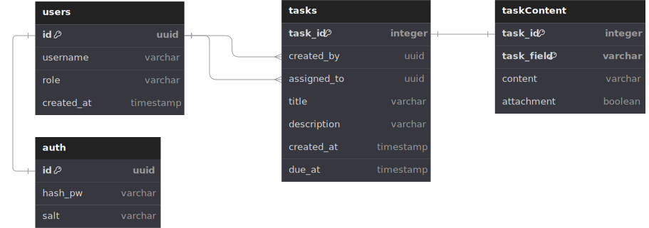

# Requirements
Basic API for a task management system that supports CRUD operations for tasks, user authentication, and **real-time updates**.

Tasks should have a title, description, deadline, assignee, as well as the ability to add custom parameters (e.g. the user can add a custom text field called "Location").

# Business Requirements
- As a user, I can create a task with a title, description, deadline, assignee, and custom parameters
- As a user, I can view tasks in a simple list view that updates in real time
- As a user, I can view/filter tasks by any field
- As a user, I can update existing tasks
- As a user, I can delete existing tasks
#### Stretch Goals
- As a user, I can upload and attach files to tasks
- As a user, I can assume the role of an admin or normal user
- As a dev, I can authenticate users using JWT

# Design

### Database Design

### Database Setup

