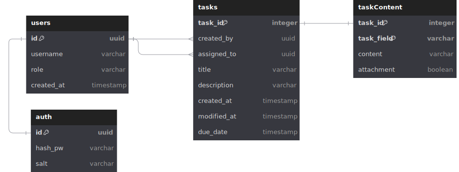

# Requirements
Basic API for a task management system that supports CRUD operations for tasks, user authentication, and **real-time updates**.

Tasks should have a title, description, deadline, assignee, as well as the ability to add custom parameters (e.g. the user can add a custom text field called "Location").

# Business Requirements
- As a user, I can create a task with a title, description, deadline, assignee, and custom parameters
- As a user, I can view tasks in a simple list view that updates in real time
- As a user, I can view/filter tasks by any field
- As a user, I can update existing tasks
- As a user, I can delete existing tasks
#### Stretch Goals
- As a user, I can upload and attach files to tasks
- As a user, I can assume the role of an admin or normal user
- As a dev, I can authenticate users using JWT

# Design

### High Level Overview

The frontend entry point uses a simple NextJS UI to fetch data from the backend.

The backend entry point uses Express to route endpoints through the `app.js` file. When requests are received, corresponding calls will be made to the `controller.js` file, which is responsible for updating/retrieving data from the database, transforming the data into server models, and any backend logic needed. This separation of concerns allows us to keep our router dumb and add more controllers for specialized logic in the future.

The `DatabaseConnector` exists in a separate package which holds all the SQL commands and PostgreSQL connection pool. This allows other apps to utilize the same database by importing this package.

The `Models` package allows the backend and frontend to utilize the same object definitions. While it's more common to distinguish the backend and frontend into separate models so that we only send the client what is explicitly needed, the scope of this project is small enough to reuse existing models.

### Database Design

This database is separated into 4 tables:
- **Users** - Stores user data. NOTE: `username` is UNIQUE
- **Auth** - Stores authenticating user login data
- **Tasks** - Stores required Task information and metadata
- **TaskContent** - Stores optional Task information, custom fields. `task_field` allows for custom field names. `attachment` is a boolean to indicate if the field is an attachment. `content` is the custom field content (in the case that `attachment = true`, content will be a URL to the blob storage provider)

### Database Setup
[Database Setup File](./database_setup.sql)

# Cost Analysis
Provided is an estimated cost to host the application using different services

### Host Options
#### AWS EC2

Assumptions:
- Concurrent Hosts: 2
- Instance: t3.medium (2 vCPUs, 4GB memory)
- 1 Region: us-east-1
- Usage: Daily 4 hour spike at 1.00 utilization, then 0.25 utilizataion

| Users     | Concurrent Hosts | Instance Hours/Host/Day (4 * (20 * 0.25)) | Instance Hours/Host/Month | Total Instance Hours/Month | EC2 Cost (Monthly, ~$0.0416/hour) |
|-----------|------------------|-------------------------|---------------------------|----------------------------|-----------------------------------|
|     1,000 |                2 |                       9 |                       270 |                        540 | **$22.46**                           |
|    10,000 |                2 |                       9 |                       270 |                        540 | **$22.46**                           |
| 1,000,000 |                2 |                       9 |                       270 |                        540 | **$22.46**                           |

#### AWS Lambda

Assumptions:
- Requests: 7,500 requests/user/month = (250 requests/user/day * 30 days)
- Avg Request time: 15ms
- Memory Allocation: 128 MB (0.125GB)

| Users   | Requests  | Exec Time (ms) | Memory (MB) | Compute (s) | GB-s     | Free Tier GB-s | Billable GB-s | Compute Cost | Free Tier Requests | Billable Requests | Request Cost | Total Cost |
|---------|-----------|----------------|-------------|-------------|----------|----------------|---------------|--------------|--------------------|-------------------|--------------|------------|
|    1000 |    750000 |             15 |         128 |       11250 |  14062.5 |         400000 |             0 |        $0.00 |            1000000 |           6500000 |        $1.30 |      **$1.30** |
|   10000 |   7500000 |             15 |         128 |      112500 |   140625 |         400000 |             0 |        $0.00 |            1000000 |          74000000 |       $14.80 |     **$14.80** |
| 1000000 | 750000000 |             15 |         128 |    11250000 | 14062500 |         400000 |      13662500 |      $214.94 |            1000000 |        7499000000 |    $1,499.80 |  **$1,714.74** |

### Database Options
#### AWS RDS

| Users     | Data Storage (GB) | RDS Instance | Storage Cost (Monthly, gp2) | Instance Cost (Monthly, t3.micro/m5.large) |         Total (Estimated)       |
|-----------|-------------------|--------------|-----------------------------|--------------------------------------------|---------------------------------|
| 1,000     | 0.02              | db.t3.micro  | $2.20                       | $15                                        | **$17.20**                        |
| 10,000    | 0.2               | db.t3.micro  | $2.20                       | $15                                        | **$17.20**                          |
| 1,000,000 | 20                | db.m5.large  | $22.00                      | $120                                       | **$142**                            |